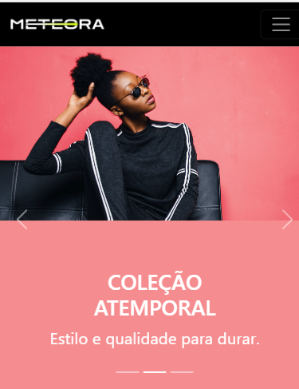
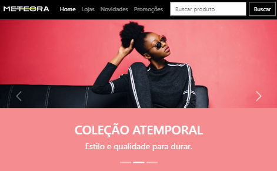
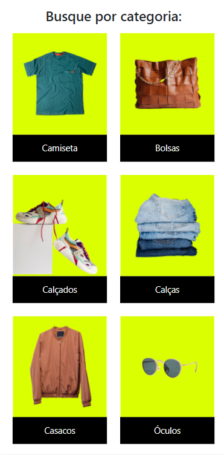
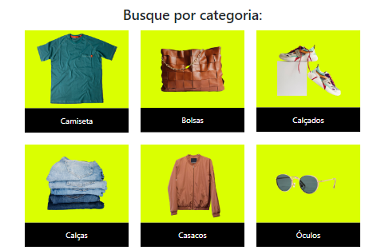

# 

### Projeto de uma landing page responsiva de uma marca fictícia de um E-commerce de roupas

<a style="border:1px solid #0f0; padding:15px 0 0 0px;background:#000;display:flex; flex-direction: column;width:240px; color:white;" href="https://meteora-bootstrap-one.vercel.app/">=======>     Clique aqui   <========</a>

### Tools ⚒️
* HTML5
* BOOTSTRAP

### Seções do projeto 📷

* Menu Bar & Carrosel

    

        <h2>Celular
        
    

    

        <h2>Tablet
        
    

    

        <h2>Celular
        
    

    

        <h2>Tablet
        
    

* Categorias

